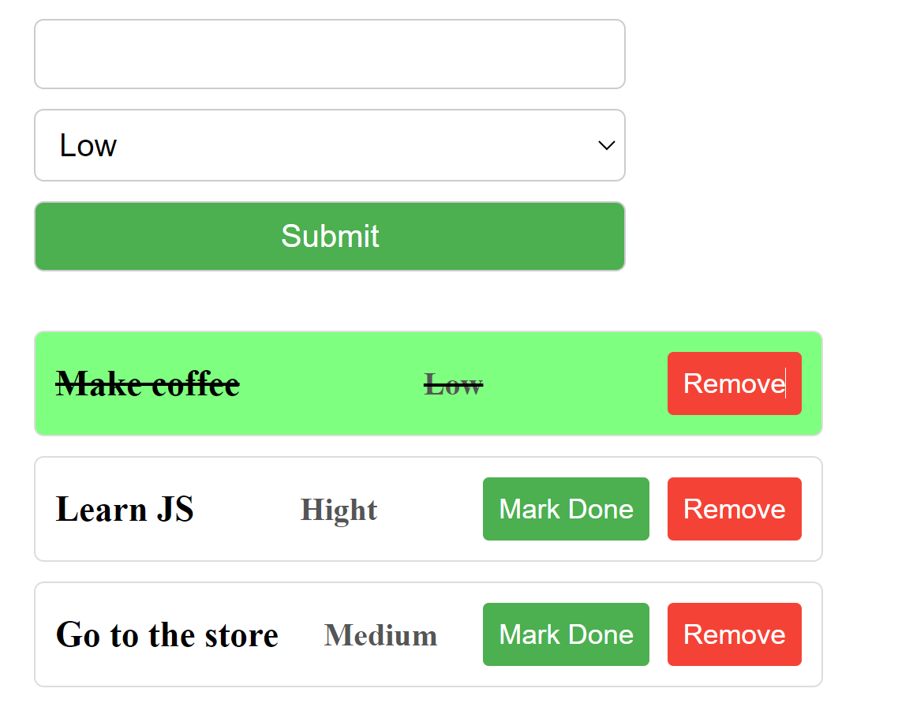
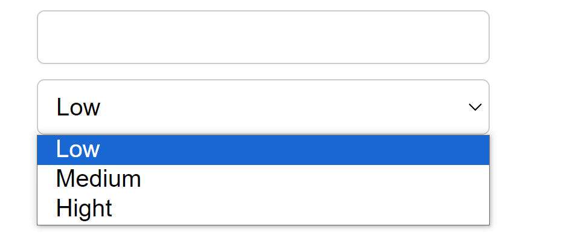
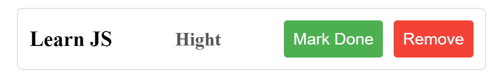
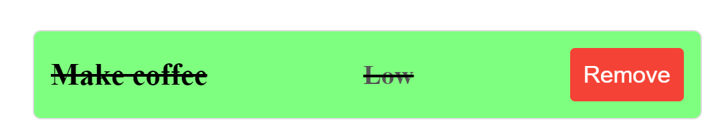
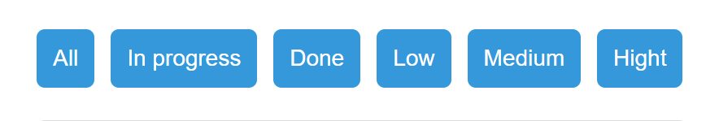

# goit-js-practice-todo-list

A simple form to add, mark as done and remove tasks to/from a ToDo list.

## Task

**TODO LIST**

Create a form that allows you to add your tasks to your task list.

  

Final result example

1. The form must contain input for the description of the task and select for the ability to choose priority of this task.

    

      
    
Form fields example

    

    

1. After submitting the form, put the tasks in the task list.
1. Each element of the list should contain: a description of the task, its priority, a button to mark it as completed (done) and a button to delete this task.

    

      
    
Single task example

    

    

  
1. After the task status has changed to completed (done), the task text should be crossed out, the background should change to green, and the button to mark it as completed (done) should disappear.

    

      
    
Completed task example

    

    

2. After clicking the delete button, the task is removed from the list.
3. After reloading the page, all tasks are stored in the list accordingly to his status.
4. Add the ability to sort the task list.
   
    

      
    
Sorting example

    

    

